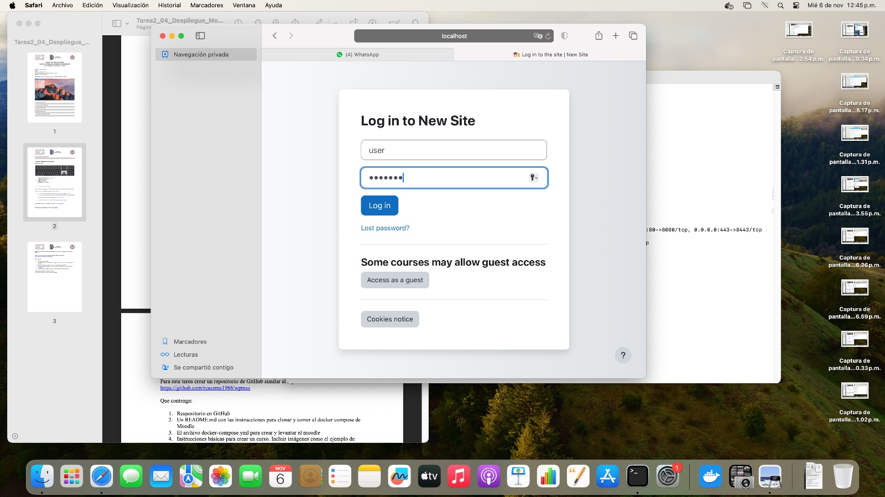
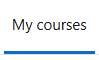
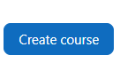
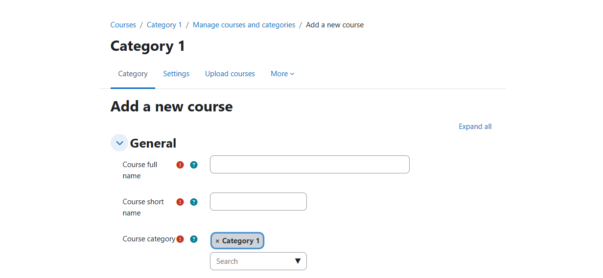
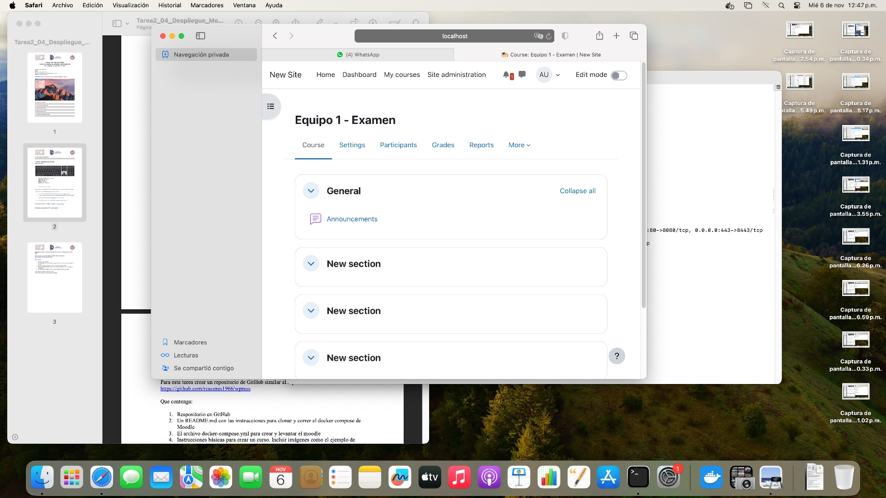
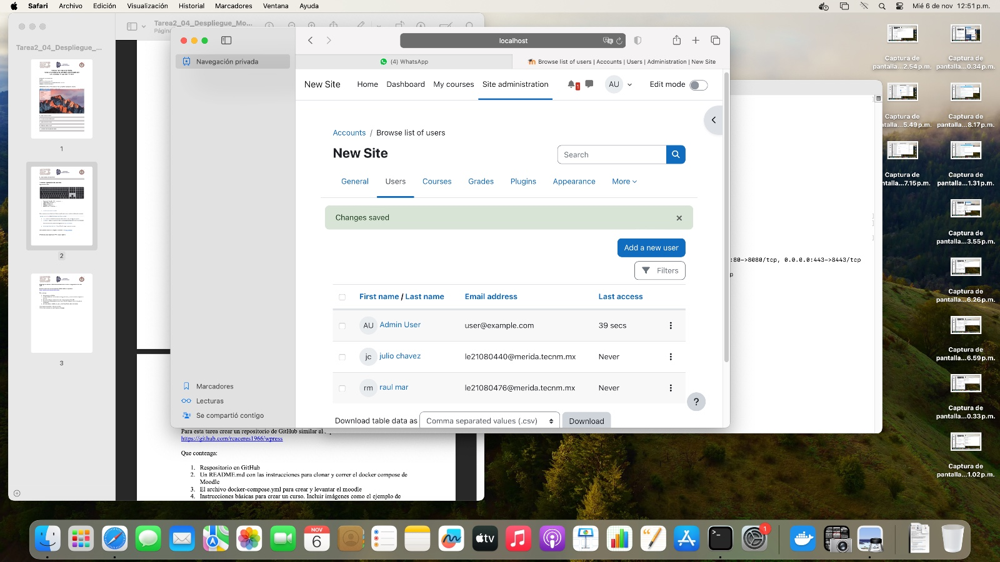
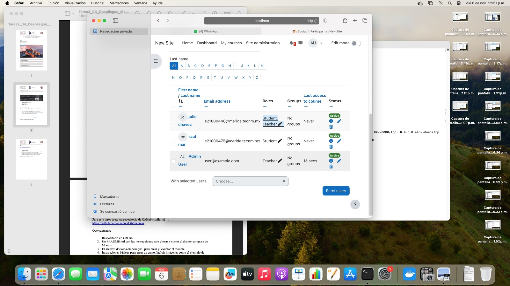

# Tarea 2.4 

---
## Paso 1. Entrar al directorio de moodle.

~~~
cd moodle
~~~

Entrar al directorio del ***moodle***.

---
## Paso 2. Compilar el docker-compose.yml.

~~~
docker-compose up -d
~~~

Compilación de archivo `docker-compose.yml`.

***Nota:*** Si desea detener la ejecución puede en algún momento más adelante, puede ejecutar el comando:

~~~
docker-compose stop
~~~

Y para iniciarlo nuevamente:

~~~
docker-compose start
~~~

---
## Paso 3. Ingresar al Moodle.

Ingrese al navegador de su preferencia y pon la `URL`:

~~~
localhost:80
~~~

Esto desplegara un ***Moodle***.

***Nota:*** Podrá iniciar sesión de haciendo ***click*** en ***login***.

	El usuario es: user.
	La contraseña es: bitnami.

---
## Paso 4. Creación de cursos.

Una vez dentro del ***moodle*** podemos crear cursos, para ello, debemos navegar por los apartados:

	- Courses/category 1/manage courses and categories/Add new course

Lo que permitirá ingresar los datos para la creación de un ***nuevo curso***:

Ingresara los datos que requiera la seccion

Haga ***click*** en el botón crear

De esta manera habrá creado un n***uevo curso***.

---
## Paso 5. Creación de usuarios.

Para la creación de usuarios: deberá navegar por los apartados:

	- Site administration/Users/Add a new user

Aquí podrá crear sus usuarios como desee:

---
## Paso 6. Asignación de usuarios a cursos y roles.

Para agregar usuarios creados a un curso, debemos ingresar al apartado de:

	My courses/"elegir el curso deseado"/Participants/Enrol users/"seleccionar los integrantes"
    Con eso tendriamos listo la creacion de los cursos con su respectivo rol

Donde podrá ingresar sus usuarios ya creados y asignar sus roles.

---